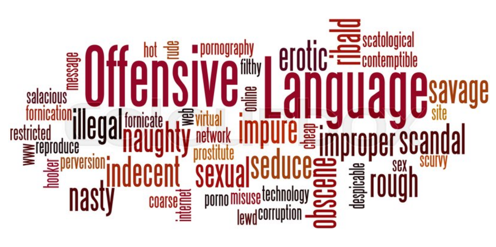

# Mineracao_dados_textos_web
## Projeto 01 - Análise de Linguagem Ofensiva no Twitter

Este trabalho é baseado na tarefa OffensEval que acontecem no âmbito das competições anuais de Semântica Computacional - SEMEVAL, edições de 2019 e 2020.

Seguem links para consulta:

<a href=http://alt.qcri.org/semeval2019/> SemEval 2019</a>

<a href=https://competitions.codalab.org/competitions/20011> OffensEval 2019</a>

A linguagem ofensiva é massivamente difundida nas mídias sociais. Os indivíduos freqüentemente se aproveitam do anonimato nas comunicações mediadas por computador, para se envolver em comportamentos, os quais não considerariam na vida real. Comunidades on-line, plataformas de mídia social e empresas de tecnologia têm investido fortemente em maneiras de lidar com linguagem ofensiva para evitar comportamentos abusivos nas mídias sociais.

Uma das estratégias mais eficazes para resolver esse problema é usar métodos computacionais para identificar ofensas, agressões e discursos de ódio no conteúdo gerado pelo usuário (por exemplo, postagens, comentários, microblogs etc.). Em Processamento de Linguagem Natural (PLN), considera-se esta uma aplicação de classificação textual (<i>Text Classification</i>)

## Objetivos

Neste projeto, são propostas duas abordagens para analisar discursos ofensivos em tweets:

(A) Subtarefa A - Identificação de Linguagem Ofensiva 

- (NOT) Not Offensive - o tweet ou texto NÃO contem ofensa ou profanidade.
- (OFF) Offensive - o tweet ou texto contem qualquer tipo de linguagem não-aceitável (ofensa ou profanidade) ou uma ofensa direcionada (velada ou direta).

(B) Subtarefa B: Categorização dos tipos de ofensa

- (TIN) Targeted Insult and Threats - o tweet contem um insulto ou ameaça a um indivíduo, um grupo ou outros.
- (UNT) Untargeted - o tweet contem insultos, palavrões, ou ofensas não-direcionadas.

## Datasets

<b> Dados de Treinamento (arquivo texto simples "olid-training-v1.0.tsv")</b>

Um conjunto com 13.240 tweets anotados com os seguintes dados:
- id do tweet 
- texto do tweet
- label para subtarefa A
- label para subtarefa B
- label para subtarefa C (desconsiderar)

Exemplo:

<table>
    <thead> 
        <tr>
            <th><b>id</b></th>
            <th><b>tweet</b></th>
            <th><b>subtarefa A</b></th>
            <th><b>subtarefa B</b></th>
            <th><b>subtarefa C</b></th>
        </tr> 
    </thead>
    <tbody> 
        <tr>
            <td>90194</td>
            <td>@USER @USER Go home you’re drunk!!! @USER #MAGA #Trump2020 👊🇺🇸👊 URL</td>
            <td>OFF</td>
            <td>TIN</td>
            <td>IND</td>
        </tr> 
        <tr>
            <td>16820</td>
            <td>Amazon is investigating Chinese employees who are selling internal data to third-party sellers looking for an edge in the competitive marketplace. URL #Amazon #MAGA #KAG #CHINA #TCOT</td>
            <td>NOT</td>
            <td>NULL</td>
            <td>NULL</td>
        </tr>
    </tbody>
</table>

## Entregas

<b> ATIVIDADE 01 </b> - Pré-processamento dos textos (Prazo: 11/05/2020 - 30%)

- Tokenização
- Lematização
- POS Tagging
- Normalização (hashtags, menções, emojis e símbolos especiais)
- NER (entidades nomeadas)
- Remoção stop-words

<b> ATIVIDADE 02 </b> - Representação Semântica (Prazo: 22/06/2020 - 30%)

- Uso de bases de conhecimento externas
- Identificação de tópicos
- Representação vetorial das palavras e textos

<b> ATIVIDADE 03 </b> - Analise da Linguagem Ofensiva - Subtarefas A e B (Prazo: 27/07/2020 - 40%)

- Resultado da subtarefa A para um conjunto de teste a ser fornecido
- Resultado da subtarefa B para um conjunto de teste a ser fornecido